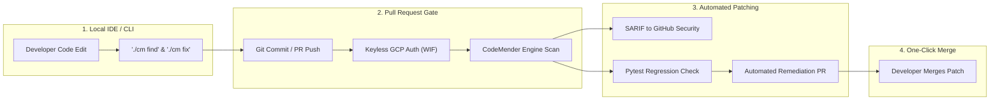
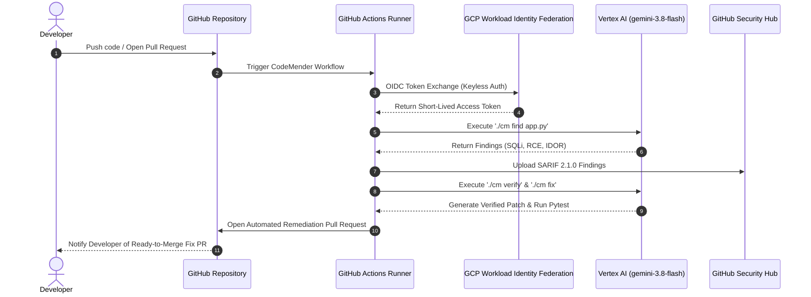

# 🛡️ CodeMender: Shift-Left SDLC Security Automation & CI/CD Demo

This repository demonstrates **CodeMender**—Google's autonomous AI security Agent—integrated directly into the **Software Development Life Cycle (SDLC)** using a **Shift-Left Security Approach**.

Using **Workload Identity Federation (WIF)** for keyless authentication to Google Cloud Vertex AI (`gemini-3.8-flash`), CodeMender automatically scans code, synthesizes exploit payloads to eliminate false positives, reports SARIF 2.1.0 findings to GitHub Security, and opens verified remediation Pull Requests.

---

## 🔄 Shift-Left SDLC Integration Paradigm

### 🎯 How CodeMender Shifts Security Left:
1. **Developer Pre-Commit Stage (`./cm find` & `./cm fix`)**: Developers can run CodeMender locally in their terminal before committing code.
2. **Pull Request Security Gate**: Automated scanning runs on every Pull Request to prevent vulnerable code from entering the `main` branch.
3. **Keyless Cloud Security**: Authenticates via **Workload Identity Federation (WIF)** using short-lived OIDC tokens (Zero stored GCP service account keys).
4. **Zero-Regression Remediation**: Runs local unit test suites (`pytest`) to verify fixes before opening automated Pull Requests.

---

## 📚 SDLC Documentation & Presentation Resources

All presentation guides, architecture diagrams, PDFs, and SDLC guides are located in the [`docs/`](./docs) directory:

| Document / Asset | Format | Direct Repository Link | Description |
| :--- | :--- | :--- | :--- |
| **Shift-Left SDLC Integration Guide** | `.md` / `.pdf` | [`docs/Shift_Left_SDLC_Integration.md`](./docs/Shift_Left_SDLC_Integration.md) / [`PDF`](./docs/Shift_Left_SDLC_Integration.pdf) | Detailed SDLC Shift-Left architecture & flow diagrams |
| **Customer Presentation Script** | `.md` / `.pdf` | [`docs/CodeMender_Customer_Presentation_Guide.md`](./docs/CodeMender_Customer_Presentation_Guide.md) / [`PDF`](./docs/CodeMender_Customer_Presentation_Guide.pdf) | Click-by-click customer demonstration script |
| **CI/CD Flow Diagram** | `.md` | [`docs/CodeMender_CICD_Flow_Diagram.md`](./docs/CodeMender_CICD_Flow_Diagram.md) | Technical Mermaid execution workflow |

---

## 🎬 Sequence Diagram: CodeMender Automated Remediation

---

## 🛠️ Demonstration Application & Live Links

- **Vulnerable Application Code**: [`app.py`](./app.py) (Contains SQL Injection, IDOR, and RCE)
- **Pytest Unit Test Suite**: [`test_app.py`](./test_app.py)
- **GitHub Code Scanning Alerts**: [Security $\rightarrow$ Code scanning](https://github.com/rgaut-create/CodeMender/security/code-scanning)
- **Automated Fix Pull Request**: [Pull Requests $\rightarrow$ PR #1](https://github.com/rgaut-create/CodeMender/pull/1)
- **CI/CD Workflow Config**: [`.github/workflows/codemender-cicd.yml`](./.github/workflows/codemender-cicd.yml)
