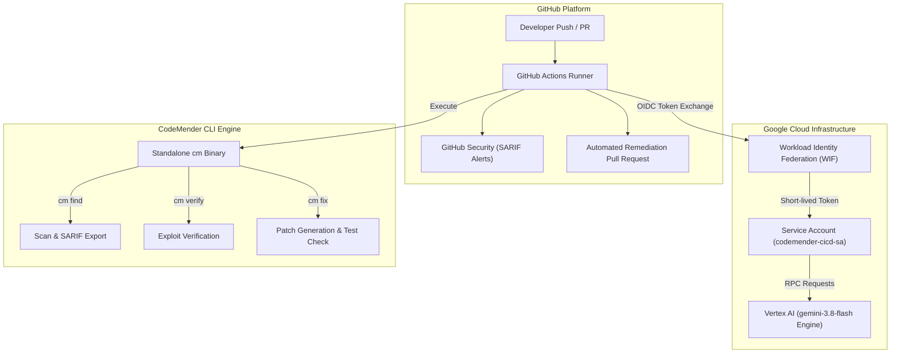

# 📊 CodeMender: Architecture & Presentation Slide Deck

> **Presentation File**: `~/CodeMender_Architecture_and_Overview.pptx`  
> **PDF Slide Deck**: `~/CodeMender_Architecture_Presentation.pdf`  
> **Target Repository**: [https://github.com/rgaut-create/CodeMender](https://github.com/rgaut-create/CodeMender)

---

## 🖼️ Slide 1: Title Slide
### CodeMender: AI-Powered Application Security
**Autonomous Vulnerability Discovery & Automated Remediation in CI/CD**

* **Presenter**: Google Security & AI Team  
* **Key Pillars**:
  - Autonomous AI Threat Discovery & Verification
  - Keyless Workload Identity Federation (WIF)
  - Production-Ready Automated Pull Request Creation

---

## 🖼️ Slide 2: Executive Overview & Problem Statement

```carousel
### The Traditional Security Bottleneck
- **High False-Positive Noise**: Legacy SAST tools generate hundreds of non-exploitable alerts.
- **Manual Triage Overhead**: Security & engineering teams waste hours verifying vulnerabilities.
- **Remediation Friction**: Developers must manually research, write, and test security patches.
<!-- slide -->
### The CodeMender AI Solution
- **Autonomous AI Security Engineer**: Integrated directly into your CI/CD pipeline.
- **100% Verified Confidence**: Synthesizes proof-of-concept exploits to eliminate false positives.
- **Automated Pull Requests**: Delivers ready-to-merge code patches verified against your unit test suite.
```

---

## 🖼️ Slide 3: End-to-End Architecture Workflow



---

## 🖼️ Slide 4: Key Architecture & Security Components

| Component | Architecture Role | Security & Enterprise Benefit |
| :--- | :--- | :--- |
| **Workload Identity Federation (WIF)** | Keyless OIDC token exchange | **Zero long-lived service account keys** stored in GitHub Secrets |
| **CodeMender Standalone CLI (`cm`)** | Portable Go binary inside CI/CD | Fully self-contained execution with zero runtime installation overhead |
| **Vertex AI LLM Engine** | Advanced multi-step reasoning (`gemini-3.8-flash`) | Context-aware vulnerability triage and patch synthesis |
| **SARIF 2.1.0 Standard** | Structured output format | Native integration with GitHub Code Scanning dashboards |
| **Pytest Verification Suite** | Pre/Post remediation test execution | **Guarantees zero functional regressions** before opening PRs |

---

## 🖼️ Slide 5: Deep Dive: Automated Remediation Engine

```carousel
### 1. Discovery Stage (cm find)
Scans target files (`app.py`), traces untrusted user inputs to dangerous sinks (SQL execution, `os.system`), and exports findings to SARIF.
<!-- slide -->
### 2. Formal Verification Stage (cm verify)
Synthesizes proof-of-concept payloads (e.g. `GET /api/user/search?username=' OR '1'='1`) to confirm whether the finding is 100% exploitable in runtime.
<!-- slide -->
### 3. Automated Patching Stage (cm fix)
Generates clean code replacements:
- Replaces string-concatenated SQL with **parameterized queries** (`cursor.execute(sql, (param,))`).
- Replaces shell system calls (`os.system`) with **safe process arrays** (`subprocess.run`).
- Validates that `pytest` passes 100% before opening the PR.
```

---

## 🖼️ Slide 6: Business Value & Customer ROI

- 🚀 **90%+ Reduction in Triage Time**: Automated exploit verification filters out non-exploitable noise.
- ⚡ **Accelerated Velocity**: Developers receive ready-to-merge Pull Requests instead of vague bug tickets.
- 🛡️ **Zero Key Storage Risk**: Keyless WIF authentication satisfies enterprise cloud compliance.
- ⏱️ **Zero-Delay Protection**: Instant security feedback on every code push.
