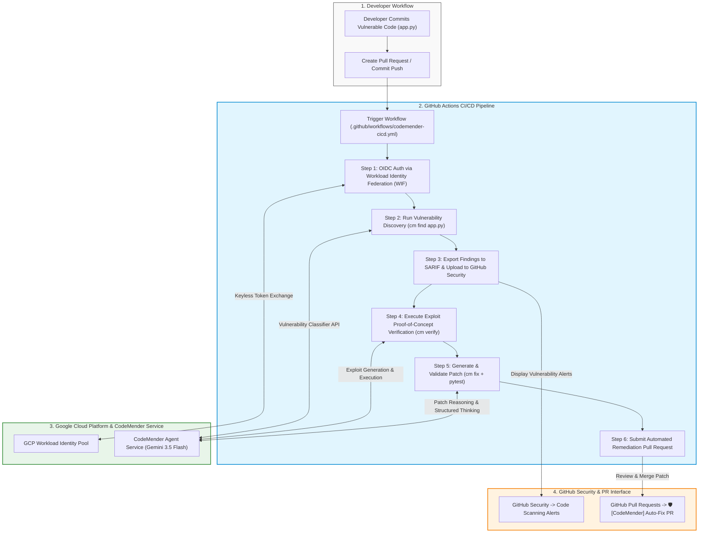
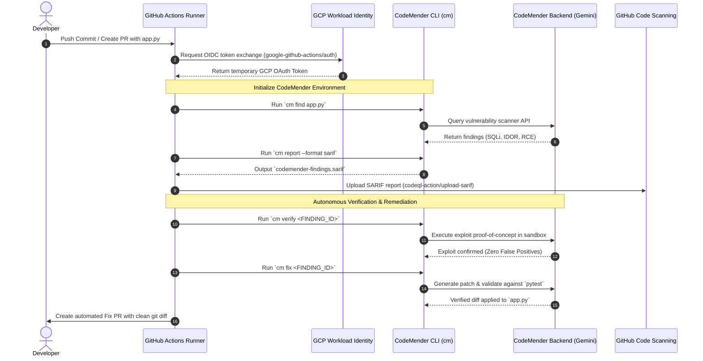
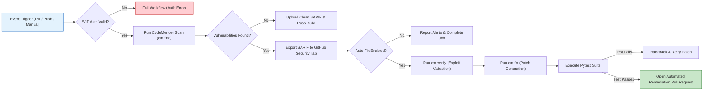

# CodeMender CI/CD End-to-End Flow Diagrams

This document contains visual **flowcharts and sequence diagrams** illustrating the end-to-end integration of **Google CodeMender** within a **GitHub Actions CI/CD pipeline**.

---

## 1. End-to-End High-Level Architecture Flow

---

## 2. Sequence Diagram: Authentication & Execution Loop

---

## 3. Pipeline Execution Stages & Decision Tree

---

## 4. Live Customer Demonstration Walkthrough

When presenting this diagram to a customer:

| Stage | What Happens | Customer Value Proposition |
| :--- | :--- | :--- |
| **1. Commit & Trigger** | Developer opens a PR containing vulnerable code (`app.py`). | Seamless shift-left scanning inside standard developer workflows. |
| **2. Keyless Auth (WIF)** | Runner exchanges GitHub OIDC token for short-lived GCP token. | Zero credential leaks: No static API keys stored in GitHub. |
| **3. Scanning & SARIF** | `cm find` scans code and uploads standard SARIF alerts to GitHub. | Fits into existing Security Operation dashboards (GitHub Security). |
| **4. Exploit Verification** | `cm verify` runs proof-of-concept exploits in an isolated sandbox. | **Zero False Positives**: Only confirmed vulnerabilities trigger fixes. |
| **5. Patch & PR Generation**| `cm fix` generates a diff and tests it against `pytest` before opening a PR. | **Autonomous Remediation**: Developers review and merge complete fixes. |
