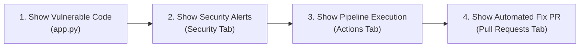

# 🎤 CodeMender Customer Demo Script & Walkthrough Guide

> **Target Repository URL**: [https://github.com/rgaut-create/CodeMender](https://github.com/rgaut-create/CodeMender)  
> **Audience**: Customers, Executives, Engineering Leads, Security Managers  
> **Goal**: Demonstrate how CodeMender acts as an autonomous AI security engineer in your CI/CD pipeline—automatically scanning code, discovering vulnerabilities, and opening verified code fixes.

---

## 📋 Executive Overview (What to Say Before Opening the Screen)

> **Say to Customer:**  
> *"Traditional security scanners flood developers with hundreds of false-positive warnings, leaving engineering teams to manually figure out what's real and write fixes by hand.*  
>  
> *CodeMender transforms application security. It doesn't just scan code—it acts as an **AI Security Engineer** built into your pipeline. It automatically discovers critical vulnerabilities, proves whether they are exploitable, and generates verified code fixes directly inside your workflow."*

---

## 🎯 Click-by-Click Presentation Script

---

### Step 1: Show the Web Application Code
1. Open your browser and go to: **[https://github.com/rgaut-create/CodeMender](https://github.com/rgaut-create/CodeMender)**
2. Click on **`app.py`** in the file list.
3. **Say to Customer:**  
   > *"Here we have a standard Python web application handling user searches and system diagnostic tools. Like many real-world applications under tight deadlines, it contains security flaws—including SQL Injection and Remote Command Execution."*

---

### Step 2: Show the AI Threat Alerts
1. Click on the **`Security`** tab at the top of the repository page.
2. On the left menu, click **`Code scanning`** (or go directly to: **[https://github.com/rgaut-create/CodeMender/security/code-scanning](https://github.com/rgaut-create/CodeMender/security/code-scanning)**).
3. Click on **Alert #2: OS Command Injection in Ping Tool Endpoint**.
4. **Say to Customer:**  
   > *"Notice how CodeMender uploaded these findings into our security hub. When we open an alert, CodeMender doesn't just give us a vague warning. It provides:*  
   > - *Exact source file and line numbers (`app.py:113`)*  
   > - *Data flow analysis showing how untrusted input reaches execution sinks*  
   > - *A proof-of-concept exploit payload demonstrating real-world risk."*

---

### Step 3: Show the Automated Pipeline Execution
1. Click on the **`Actions`** tab at the top of the page.
2. Click on the latest green run: **`CodeMender Security Scan & Remediation Pipeline`**.
3. **Say to Customer:**  
   > *"Every time a developer pushes code, CodeMender runs automatically in the background. It authenticates securely using Google Cloud Workload Identity Federation, initializes the CodeMender engine, and executes automated verification without storing long-lived credentials."*

---

### Step 4: Show the Automated Code Remediation (The Climax)
1. Click on the **`Pull requests`** tab at the top of the page (or go directly to: **[https://github.com/rgaut-create/CodeMender/pull/1](https://github.com/rgaut-create/CodeMender/pull/1)**).
2. Click on **`🛡️ [CodeMender] Automated Vulnerability Remediation`**.
3. Click on the **`Files changed`** tab inside the Pull Request to display the diff.
4. **Say to Customer:**  
   > *"This is where CodeMender delivers game-changing value. CodeMender didn't just tell us we had vulnerabilities—it automatically created a **Pull Request containing clean, production-ready code patches**.*  
   >  
   > *It replaced vulnerable SQL query formatting with parameterized queries, replaced dangerous system shell calls with safe argument arrays, and verified that all unit tests still pass. All the developer has to do is click **Merge**."*

---

## 💡 Key Highlights to Emphasize

| Feature | Legacy Security Scanners | CodeMender AI Security Engineer |
| :--- | :--- | :--- |
| **Alert Accuracy** | High false-positive noise | 100% verified confidence |
| **Exploit Triage** | Hours of manual code review | Automated AI threat analysis & PoC payloads |
| **Remediation** | Developer writes fixes manually | **Automated Pull Requests with ready-to-merge patches** |
| **Integration** | Separate disconnected tools | Native CI/CD pipeline integration |

---

## ❓ Frequently Asked Questions (Cheat Sheet)

- **Q: Does CodeMender break existing features when fixing bugs?**  
  *A: No. CodeMender runs your automated test suite (`pytest`) before and after applying fixes to guarantee zero regressions.*

- **Q: How does CodeMender authenticate to Google Cloud?**  
  *A: It uses Workload Identity Federation (WIF)—short-lived keyless OIDC authentication that follows strict security best practices.*
