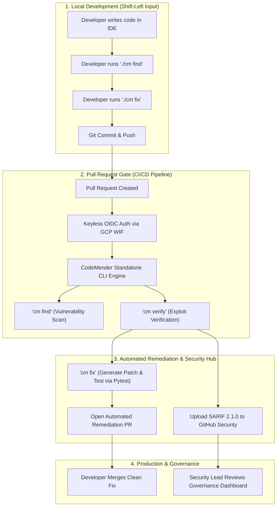
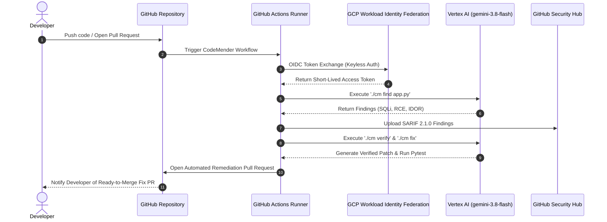

# 🔄 Shift-Left SDLC Integration with CodeMender

## 🌟 Executive Overview

Traditional Application Security Testing (SAST/DAST) relies on **"Shift-Right"** security gates—scanning code late in the Software Development Life Cycle (SDLC) after deployment or right before release. This approach causes major bottlenecks:

- **Late Discovery**: Vulnerabilities found late in SDLC cost **10x–100x more** to fix.
- **High Triage Overhead**: Security teams are flooded with non-exploitable false positives.
- **Developer Context Switching**: Fixing security bugs weeks after writing code disrupts engineering velocity.

**CodeMender** revolutionizes AppSec by implementing a true **Shift-Left Security Paradigm**. Operating as an autonomous **AI Security Engineer**, CodeMender embeds security directly into every stage of the developer workflow—from local code editing to Pull Request validation and CI/CD pipeline triggers.

---

## 🏗️ Shift-Left SDLC Architecture Flow Diagram

---

## 🚀 SDLC Stage Breakdown: Shift-Left Security Gates

### Stage 1: IDE & Pre-Commit (Local Developer CLI)
- **Tooling**: Standalone `./cm` CLI binary.
- **Workflow**: Developers can run `./cm find app.py` locally before pushing code.
- **Value**: Catches SQL Injection, RCE, and IDOR flaws at the moment of creation, providing instant feedback in the developer's terminal.

---

### Stage 2: Pull Request Security Gate (Automated PR Check)
- **Tooling**: GitHub Actions Workflow (`.github/workflows/codemender-cicd.yml`).
- **Workflow**: Every Pull Request automatically triggers CodeMender scanning.
- **Key Features**:
  - **Keyless Authentication**: Authenticates to Google Cloud Vertex AI using **Workload Identity Federation (WIF)**.
  - **Exploit Verification**: Synthesizes proof-of-concept payloads to verify 100% exploitability.
  - **Regression Safety**: Runs local unit test suites (`pytest`) to guarantee zero broken functionality.

---

### Stage 3: Automated Remediation & Governance Dashboard
- **Tooling**: GitHub Code Scanning & `peter-evans/create-pull-request`.
- **Workflow**: Findings are uploaded as SARIF 2.1.0 files to **GitHub Security -> Code Scanning**.
- **Automated Fix PR**: CodeMender automatically branches the repository, applies context-aware security patches (e.g. parameterized queries, safe subprocess arrays), and opens a ready-to-merge Pull Request.

---

## 🔄 Sequence Diagram: CodeMender Automated Remediation Lifecycle

---

## 💡 Key Shift-Left Benefits for Enterprise Teams

| Metric | Legacy SAST (Shift-Right) | CodeMender (Shift-Left) |
| :--- | :--- | :--- |
| **Feedback Loop** | Days/Weeks after deployment | **Seconds/Minutes during PR build** |
| **False-Positive Noise** | 40%–60% non-exploitable warnings | **0% (Verified via AI Exploit Synthesis)** |
| **Developer Effort** | Manual vulnerability research & patching | **One-click PR Merge** |
| **Security Governance** | Fragmented spreadsheets | **Native SARIF & Keyless GCP IAM Auditing** |
